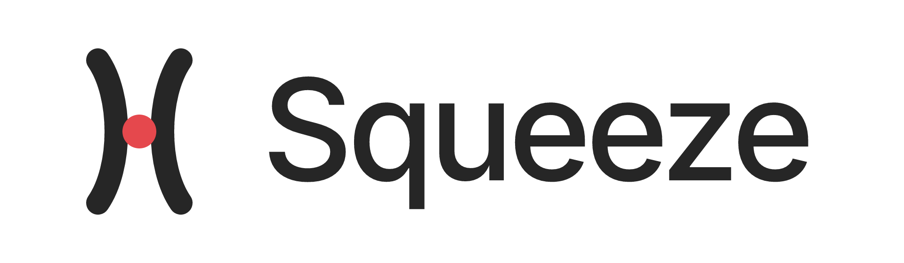

**The borrow desk and short interest tape for Robinhood Chain.**

Pons has launched 50,000+ tokens on Robinhood Chain. Every one of those markets is long-only. Squeeze is a collateralised borrow market for those tokens — and the public short interest tape that only exists once real borrowing does.

| | |
|---|---|
| Chain | Robinhood Chain — Arbitrum Orbit L2, chainId `4663`, ETH gas, ~100ms blocks |
| Venue | Uniswap **V3**, 1% fee tier, TOKEN/WETH — the pool each Pons token launched in |
| Collateral | ETH only (v1) |

## Status

Be clear about this, because half of what follows is real and half is not.

| | |
|---|---|
| **The Tape (v0)** | **Live.** Reads Robinhood Chain, no API key, no dependencies. |
| **Oracle verification** | **Live.** `verify-oracle.mjs` proves the core claim against mainnet. |
| **The Desk** | **Not built.** No contracts written, none deployed, nothing audited. |
| **Token** | **Does not exist.** No presale, no contract address. Anyone showing you one is not us. |

Short-interest fields in the dataset are `null` everywhere by design — they cannot exist until the Desk does, and filling them with plausible numbers would make the whole thing worthless.

## Run it

Node 18+. Nothing else.

```bash
node indexer/verify-oracle.mjs      # prove a real TWAP exists on a live pool
node indexer/build-tape.mjs         # rebuild data/tape.json from chain state
python -m http.server 3040          # then open /site/ and /docs/
```

Point the verifier at any token:

```bash
node indexer/verify-oracle.mjs 0x<token>
```

## How it is possible

The long version is in [the docs](docs/index.html) and [`SPEC.md`](SPEC.md).

**Uniswap V4 removed built-in price oracles**, moving observation tracking into optional hooks. Pons runs on **V3**, which carries the TWAP oracle inside the pool itself. For this use case the older version is strictly better — a manipulation-resistant price is available from `pool.observe()` with no new contracts and no cooperation from anyone.

Three things follow:

1. **Liquidity can't be pulled.** Pons locks LP at launch creation and graduation (4.2 ETH) moves nothing — the pool a short sells into is permanent.
2. **Manipulation is expensive.** Liquidation requires the 30-minute *and* the 5-minute TWAP to breach. A one-block pump costs the attacker slippage and closes nothing.
3. **Liquidation is fast.** Bad debt lives in the gap between "health factor breaks" and "keeper closes". On L1 that gap is 12 seconds plus a gas auction. On a 100ms chain with FCFS sequencing and no priority fees, it is a few hundred milliseconds.

**Nothing here is new.** The lending side is Aave logic, the pricing side is a standard V3 TWAP read, the execution side is `exactInputSingle`. No new cryptography, no AMM primitive, no hook, no custom pool. Squeeze touches the Pons pools in exactly two ways — `observe()` to read and a swap to execute — so no integration is required and nobody can revoke access.

## Two things the chain taught us

Both of these contradict what the spec originally assumed. They are in here because they were measured, not reasoned.

**Cardinality tracks traction, not age.** The textbook claim is that a V3 pool ships with one observation and needs provisioning. In practice the liquid Pons markets already carry deep buffers — $PONS holds 20,000 observations, $HMM 14,400 — while dormant micro-caps sit at 1. The listing step is real but usually already satisfied for exactly the tokens that clear the other criteria.

**Cardinality 1 does not revert — and that is the dangerous part.** A single-observation pool still *answers* `observe(1800)`. It extrapolates from that one point using the current tick, so the call succeeds and returns something that looks like a TWAP. It carries no history, both windows collapse onto spot, and the dual-bound check silently degrades into "is spot above the threshold" — the exact manipulation surface the design exists to close. Nothing errors, so a naive integration would never notice. Squeeze gates on `cardinality > 1` before trusting any returned price.

## Repository layout

```
SPEC.md          full mechanism spec (Dutch) — the source of truth
indexer/         the live data layer
  lib.mjs        RPC, ABI decoding, V3 reads
  verify-oracle.mjs  pass/fail proof against a live pool
  build-tape.mjs     writes data/tape.json
data/tape.json   generated — refreshed every 6h by CI
docs/            protocol documentation site
site/            marketing site, renders data/tape.json
```

Both sites are static HTML with no build step.

## Risk

Documented rather than buried. The most likely way this protocol dies is a vertical pump on a thin pool outrunning liquidation and leaving bad debt. If the Backstop Fund is ever exhausted, remaining bad debt is socialised across lenders in the affected vault. See [Risk disclosures](docs/index.html#risk).

## Not affiliated

Squeeze is an independent protocol. Not affiliated with, endorsed by, or connected to Robinhood Markets, Inc., Pons, or Uniswap Labs. Nothing here is financial advice.

## License

MIT — see [LICENSE](LICENSE).
